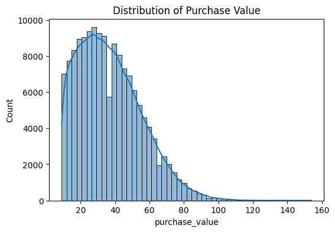

# Improved Detection of Fraud Cases for E-commerce and Bank Transactions
## Business Objective and Project Overview 
The primary objective of this project is to develop a robust, accurate, and interpretable fraud 
detection system for e-commerce and banking transactions. Fraudulent activities pose 
significant risks to financial institutions and online platforms, including direct financial losses, 
reputational damage, regulatory penalties, and erosion of customer trust. 
An effective fraud detection solution must accurately identify fraudulent transactions while 
minimizing false positives, ensuring that legitimate customers are not unnecessarily 
inconvenienced. This balance between security and user experience is critical in maintaining 
customer satisfaction and long-term trust. 
## mportance of Fraud Detection in Business Context 
Accurate fraud detection systems: 
- Reduce financial losses caused by unauthorized transactions 
- Strengthen regulatory compliance through risk-based decision-making 
- Enhance customer trust by ensuring secure and reliable transaction processing 
- Enable proactive fraud prevention rather than reactive investigation 

# Project Structure 
```
adey_innovations
├── .github/ 
│   └── workflows/ 
│       └── unittests.yml 
├── data/                           # Ignored in version control 
│   ├── raw/                        # Original datasets 
│   └── processed/            # Cleaned and feature-engineered data 
├── notebooks/ 
│   ├── __init__.py 
│   ├── eda-fraud-data.ipynb 
│   ├── eda-creditcard.ipynb 
├── src/ 
│   ├── __pycache__/ 
│   └── data_processing.py 
├── requirements.txt 
├── README.md 
└── .gitignore 
```
# Task 1: Data Analysis and Preprocessing 
 Handling Missing Values 
- Numerical features 
- Imputed using the median to reduce sensitivity to outliers, which are common in 
fraud data. 
- Categorical features 
 Imputed using the mode or labeled as "Unknown" when missing values may carry 
meaningful information. 
-Justification 
- Fraud datasets are typically skewed; median and mode preserve distribution 
characteristics better than mean imputation. 
-Removing Duplicates 
- Duplicate records were removed based on full-row duplication. 
-  This prevents bias in frequency-based features and avoids inflating transaction counts. 
# # Univariate analysis
